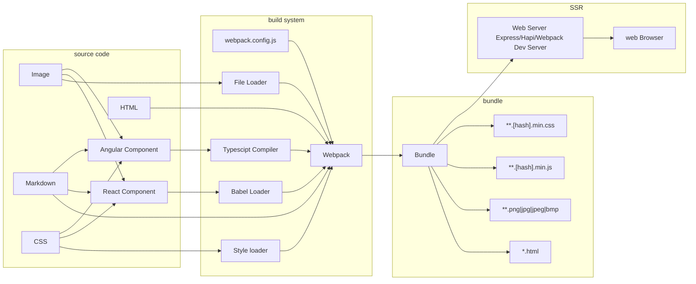
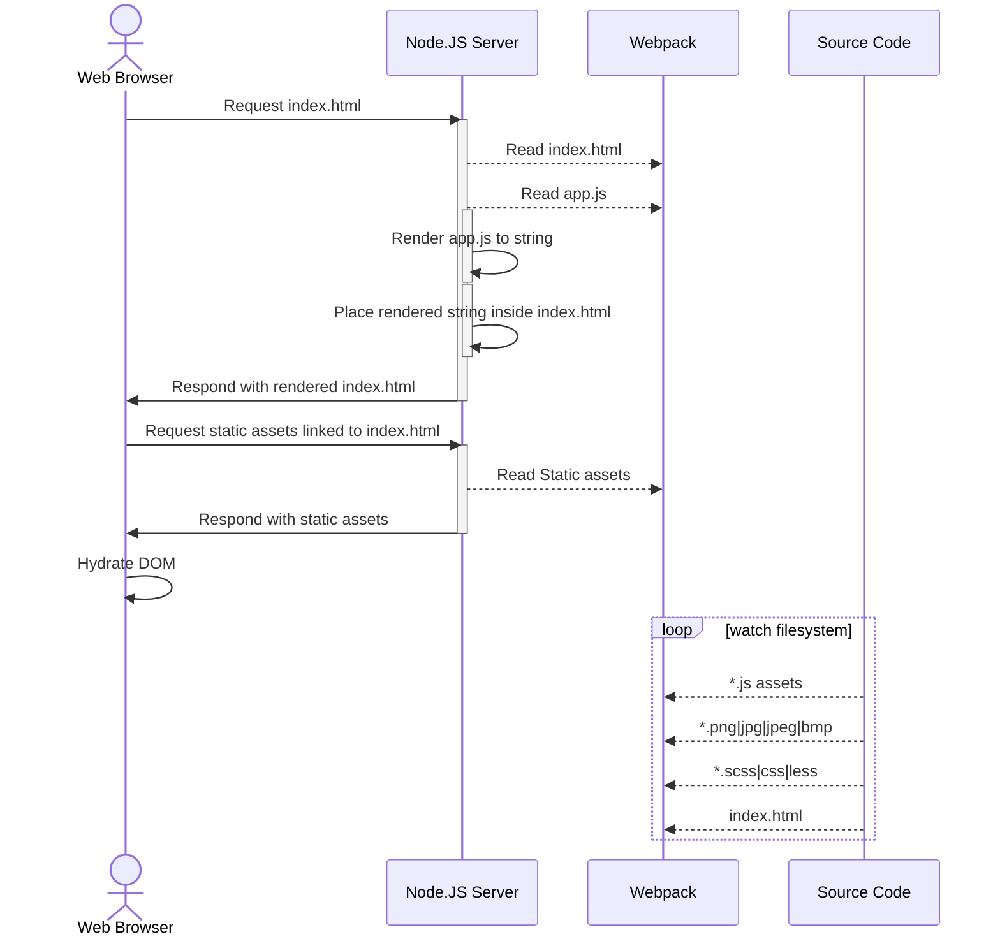
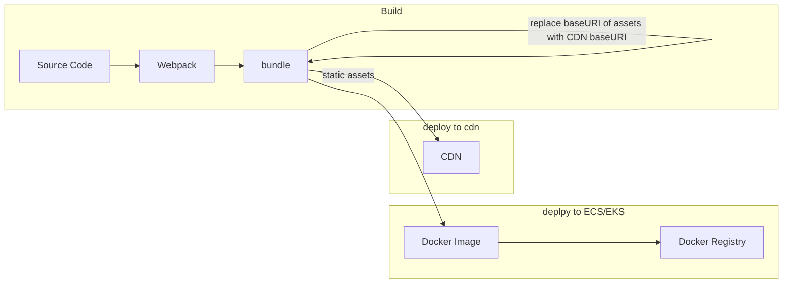
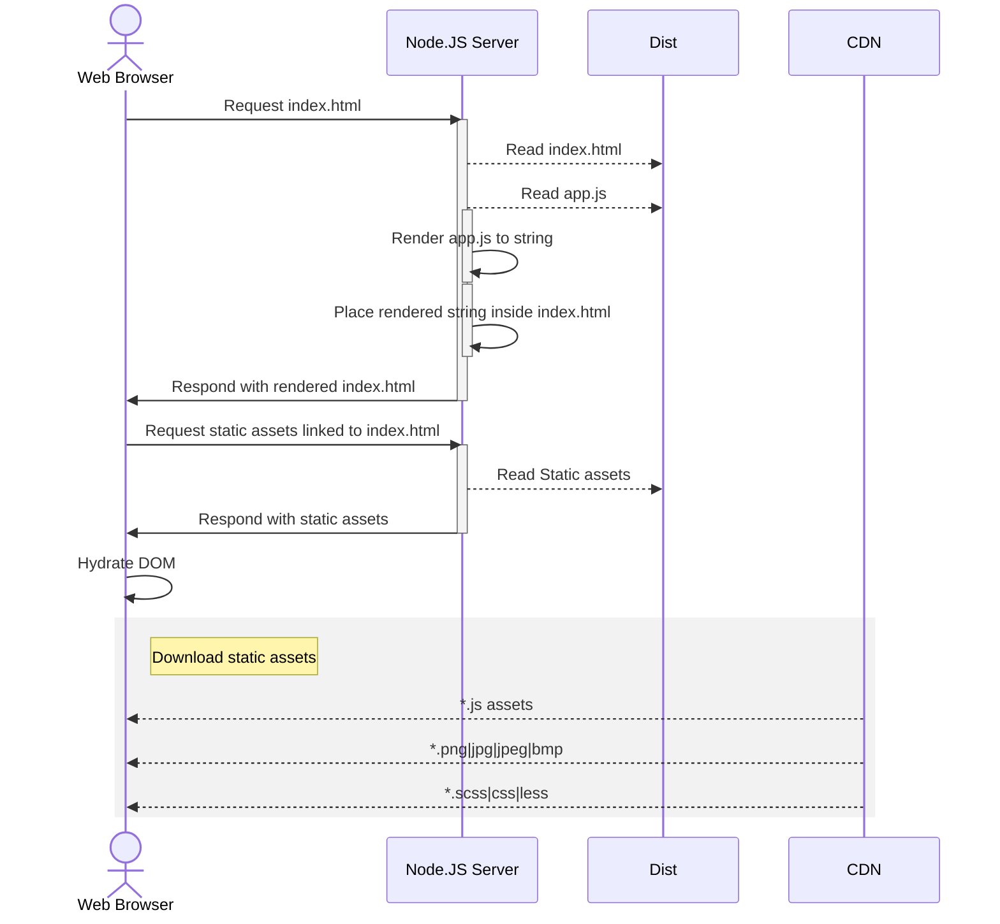

# Development and deployment of modern UI apps (PWAs & SPAs)

## Reading this document

Anyone with basic background in web application development can easily read and understand this document. Readers who do not have background in web application development can try google [web.dev/learn](https://web.dev/learn/) to develop a basic understanding.

## SPA

Single Page Application (via [mdn web docs](https://developer.mozilla.org/en-US/docs/Glossary/SPA))

> ```An SPA (Single-page application) is a web app implementation that loads only a single web document, and then updates the body content of that single document via JavaScript APIs such as XMLHttpRequest and Fetch when different content is to be shown.```


## Anatomy of a UI application

Modern UI Applications are becoming overly complicated with a lot of inter dependencies between different types of files. We can take a look at the diagram below and try to visualise how most of our apps look like



## Local development workflow



## Build Process for Deployment



## Production/Staging





